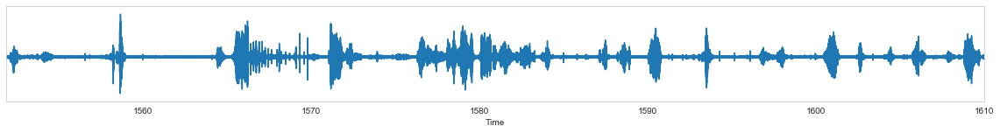
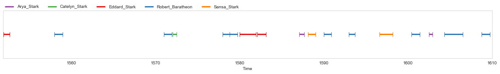

# PLUMCOT 0





The PLUMCOT corpus provides annotation for face recognition, transcription (available for all episodes), person named-entities, speech activity (duration<sub>a</sub>, available for all episodes), and speaker identities (duration<sub>i</sub>) of 16 TV (or movie) series :

| Serie   |  | |  | Transcription | Entities | | Speech | | |
|------------------------------------------------------|-------|-------|-----------|-------|---------------|-------|-------|-------------------|--------------|
| *title*                                               | *short* | *episodes* | *duration* | *tokens*    | *episodes* | *tokens*  | *episodes* | *duration<sub>a</sub>* | *duration<sub>i</sub>* |
| 24                                                   | \-    | 195      | 136:24   | 868,782   | \-       | \-      | \-       | 36:17             | \-                |
| Battlestar Galactica                                 | BG    | 71       | 52:16    | 264,066   | \-       | \-      | 61       | 10:53             | 08:49             |
| Breaking Bad                                         | BB    | 61       | 46:29    | 205,952   | \-       | \-      | 61       | 17:06             | 17:06             |
| Buffy the Vampire Slayer                             | Buffy | 143      | 101:18   | 587,165   | 12       | 73,301  | 143      | 25:55             | 25:55             |
| ER                                                   | \-    | 283      | 201:02   | 1,747,563 | \-       | \-      | \-       | 63:06             | \-                |
| Friends                                              | \-    | 233      | 84:56    | 618,237   | \-       | \-      | 233      | 28:04             | 28:04             |
| Game of Thrones                                      | GoT   | 60       | 53:09    | 278,917   | 10       | 53,035  | 60       | 19:13             | 19:13             |
| Harry Potter                                         | HP    | 8        | 18:51    | 63,677    | 1        | 12,250  | 4        | 02:44             | 01:28             |
| Homeland                                             | \-    | 70       | 57:49    | 333,405   | \-       | \-      | \-       | 12:24             | \-                |
| Lost                                                 | \-    | 66       | 46:48    | 367,546   | 7        | 66      | 07:12    | 07:12             |
| Six Feet Under                                       | SFU   | 63       | 56:43    | 326,542   | \-       | \-      | \-       | 15:11             | \-                |
| Star Wars                                            | SW    | 7        | 15:05    | 75,903    | 1        | 18,123  | 7        | 02:13             | 02:13             |
| The Big Bang Theory                                  | TBBT  | 207      | 68:41    | 547,193   | 17       | 61,285  | 207      | 25:23             | 25:23             |
| The Lord of the Rings                                | TLOR  | 3        | 08:56    | 29,162    | \-       | \-      | 3        | 00:47             | 00:47             |
| The Office                                           | TO    | 188      | 71:45    | 575,500   | 6        | 24,692  | 188      | 30:15             | 30:15             |
| The Walking Dead                                     | TWD   | 89       | 65:00    | 321,334   | 19       | 93,599  | 25       | 08:32             | 02:46             |
| *TOTAL*                                   | \-    | 1,747    | 1085:20  | 7,210,944 | 73       | 336,285 | 1,058    | 305:25            | 169:19            |


Transcriptions were scraped from various fan-websites, see [LICENSE](#LICENSE).

Person named-entities annotation were annotated semi-automatically from the transcripts, see [CONTRIBUTING](./CONTRIBUTING.md).

Speaker annotations come from forced-alignment on series transcripts except for Breaking Bad and Game Of Thrones which were manually annotated by Bost et al.

Face recognition annotations consists of a dataset of images labeled with the featured characters, scrapped from [IMDb](https://www.imdb.com/). No bounding box nor video identification annotations are provided (for now).

In addition, this repository provides a Python API to access the corpus programmatically.

## Installation

Until the package has been published on PyPI, one has to run the following commands:

```bash
$ git clone https://github.com/PaulLerner/pyannote-db-plumcot.git
$ pip install pyannote-db-plumcot
```

## Usage

Please refer to [pyannote.database](https://github.com/pyannote/pyannote-database#custom-protocols) for a complete documentation.

```bash
export PYANNOTE_DATABASE_CONFIG=$PWD/pyannote-db-plumcot/Plumcot/data/database.yml
python
```

### Speaker Diarization / Identification and Entity Linking

```python
>>> from pyannote.database import get_protocol

# you can access the whole dataset using the meta-protocol 'X'
>>> plumcot = get_protocol('X.SpeakerDiarization.Plumcot')
# Note : this might take a while...
>>> plumcot.stats('train')
{'annotated': 710303.0550000002, 'annotation': 383730.8849999984, 'n_files': 681, 'labels': {...}}

# or access each serie individually, e.g. 'HarryPotter'
>>> from pyannote.database import get_protocol
>>> harry = get_protocol('HarryPotter.SpeakerDiarization.0')
>>> harry.stats('train')
{'annotated': 5281.429999999969, 'annotation': 2836.8099999998867, 'n_files': 2, 'labels': {...}}
# get the first file of HarryPotter.SpeakerDiarization.0's test set
>>> first_file = next(harry.test()) 
>>> first_file['uri']                                                                                                                                                                                   
'HarryPotter.Episode01'
# top 5 speakers of HarryPotter.Episode01
>>> first_file['annotation'].chart()[:5]                                                                                                                                                                
[('harry_potter', 417.1699999999951),
 ('rubeus_hagrid', 321.49000000000785),
 ('ron_weasley', 259.1599999999926),
 ('hermione_granger', 217.5499999999979),
 ('albus_dumbledore', 186.04999999999941)]
# On some files we provide entity linking annotation in a SpaCy Doc
# Beware, this might lead to a KeyError
>>> entity = first_file['entity'] 
>>> from pyannote.core import Segment 
>>> for token in entity[:11]: 
>>>     segment = Segment(token._.time_start, token._.time_end) 
>>>     print(f'{segment} {token._.speaker}: {token.text} -> {token.ent_kb_id_}')                                                                                                                        
[ 00:01:18.740 -->  00:01:18.790] albus_dumbledore: I -> albus_dumbledore
[ 00:01:18.830 -->  00:01:18.980] albus_dumbledore: should -> 
[ 00:01:18.980 -->  00:01:19.100] albus_dumbledore: have -> 
[ 00:01:19.160 -->  00:01:19.430] albus_dumbledore: known -> 
[ 00:01:19.460 -->  00:01:19.580] albus_dumbledore: that -> 
[ 00:01:19.600 -->  00:01:19.700] albus_dumbledore: you -> professor_mcgonagall
[ 00:01:19.700 -->  00:01:19.820] albus_dumbledore: would -> 
[ 00:01:19.820 -->  00:01:19.940] albus_dumbledore: be -> 
[ 00:01:19.940 -->  00:01:20.380] albus_dumbledore: here -> 
[ 00:01:21.660 -->  00:01:22.130] albus_dumbledore: ...Professor -> 
[ 00:01:22.380 -->  00:01:22.600] albus_dumbledore: mcgonagall -> professor_mcgonagall
```

### Speech Activity Detection and transcription

Note that the previous dataset is also suitable for Speech Activity Detection but is smaller.

```python
>>> from pyannote.database import get_protocol

# you can access the whole dataset using the meta-protocol 'X'
>>> plumcot = get_protocol('X.SpeakerDiarization.SAD')
# Note : this might take a while...
>>> plumcot.stats('train')
{'annotated': 1286065.3450000014, 'annotation': 716507.5149999945, 'n_files': 1144, 'labels': {...}}

# or access each serie individually, e.g. 'HarryPotter'
>>> harry = get_protocol('HarryPotter.SpeakerDiarization.SAD')
>>> harry.stats('train')
{'annotated': 12864.489999999932, 'annotation': 5853.799999999804, 'n_files': 5, 'labels': {...}}
# get the first file of HarryPotter.SpeakerDiarization.0's test set
>>> first_file = next(harry.test()) 
>>> first_file['uri']                                                                                                                                                                                   
'HarryPotter.Episode01'
# The 'transcription' key should *always* be available, even when speaker identity is not
>>> transcription = first_file['transcription']
>>> from pyannote.core import Segment 
>>> for token in transcription[:11]: 
>>>     s = Segment(token._.time_start, token._.time_end) 
>>>     print(f'{s}: {token.text}') 
[ 00:01:18.740 -->  00:01:18.790]: I
[ 00:01:18.830 -->  00:01:18.980]: should
[ 00:01:18.980 -->  00:01:19.100]: have
[ 00:01:19.160 -->  00:01:19.430]: known
[ 00:01:19.460 -->  00:01:19.580]: that
[ 00:01:19.600 -->  00:01:19.700]: you
[ 00:01:19.700 -->  00:01:19.820]: would
[ 00:01:19.820 -->  00:01:19.940]: be
[ 00:01:19.940 -->  00:01:20.380]: here
[ 00:01:21.660 -->  00:01:22.130]: ...Professor
[ 00:01:22.380 -->  00:01:22.600]: mcgonagall
```
> Note: we don't provide for the series audio or video files! You'll need to acquire them yourself then place them in the relevant serie directory (e.g. `HarryPotter/wavs`) with file name formatted as `<file_uri>.en16kHz.wav`. See also [DVD section](#DVDs).

## Raw data

Transcripts, diarization and entities annotation can be found as text file in `Plumcot/data` sub-directory. Formats etc. are described in [`CONTRIBUTING.md`](CONTRIBUTING.md).

The face recognition dataset is provided from an external link : **[TODO](TODO)**. Alternatively, you can scrap the images yourself using [`scripts/images_scraping.py`](./scripts/image_scraping.py) (see [`CONTRIBUTING.md`](CONTRIBUTING.md)).

### Entities

Some issues were not anticipated before annotation of entities, resulting in those hacks (implemented in `Plumcot.loader` so beware if you use the raw data), see also [#13](https://github.com/PaulLerner/pyannote-db-plumcot/issues/13).

- Since we only annotated person-named entities, the entity type (which was originally set automatically) is always set to "PERSON" when entity label is not empty and to "" otherwise.
- Entities annotation is tokenized, unlike forced-alignment. It's not straightforward to align both annotations. 
If both are provided (i.e. in `0` protocols), we follow the tokenization of forced-alignment (i.e. split on whitespaces), therefore some linguistic attributes (e.g. POS) may be lost in the process.
If you're not interested in the audio/timing content of the annotation, you can use the `EL` protocols (e.g. 'HarryPotter.SpeakerDiarization.EL') which follow the tokenization of the entity.
These were used to obtain the NER results reported in the paper (see also the script [ner.py](./scripts/ner.py)).

    
### DVDs

Episode numbering relies on [IMDb](https://www.imdb.com/).

We acquired zone 2 (i.e. Europe) DVDs. DVDs were converted to mkv and wav using [dvd_extraction](https://github.com/PaulLerner/dvd_extraction).

[`durations.csv`](Plumcot/data/durations.csv) provides the audio duration of the resulting wav files.

Some (double) episodes are numbered as two different episodes in the DVDs although they're numbered as one in IMDb. These are listed in the `double_episodes/` folder of the relevant serie, if needed.

> TODO: automate the creation of `double_episodes/` files so that the user doesn't have to replace `/vol/work3/lefevre/dvd_extracted/` manually.

The episodes are then concatenated using ffmpeg:
```bash
cd pyannote-db-plumcot/
bash scripts/concat_double_episodes.sh <serie_uri> </path/to/wavs>
```

Note that this will only create a new wav file resulting of the concatenation of `<episode.i>` and `<episode.j>` named like `<episode.i.j>` but it will not fix the numbering of the others episodes (TODO: add code to do it ?)

## Ambiguous labels

Some labels are ambiguous depending on whether we focus on the speaker or on the entity.

We decided to focus on the entity as much as possible, e.g. 'Obiwan Kenobi' has the same label in the old and the new Star Wars movies, although it is not the same actor (i.e. speaker).

However, we annotated following the IMDb credits which are not always consistent, e.g. the emperor in Star Wars doesn't have the same label in the old and the new episodes.

> Disclaimer : we do not intend to use the whole `X.SpeakerDiarization.Plumcot` corpus
> to train or evaluate speaker diarization systems! Indeed, the classes are largely
> imbalanced, a lot of actors (i.e. speakers) play in multiple series and a lot of
> characters share labels across series (see [`actor_counter`](Plumcot/data/actor_counter.json) and [`counter
>`](Plumcot/data/counter.json), respectively).

Moreover, some secondary characters (most don't have proper names) are played by several different actors through the same serie. These are listed in [`not_unique.json`](./Plumcot/data/TheOffice/not_unique.json) and should be removed from the evaluation (TODO).

> IMDb credits were updated [on 17/03/2020 in 123e37cb](https://github.com/PaulLerner/pyannote-db-plumcot/commit/123e37cb8b64bb6a9bdd89ed665a2769d992569f), therefore some annotated labels are inconsistent with these new IMDb credits and should be updated.
> This can be done using the script `fix_names.py`. 
> However the 1-1 mapping leads to some issues: some actors that play multiple minor characters would have all their minor characters point to the major one.
> See `characters.diff.json` in the respective serie folder.


    
## LICENSE

### Source code

The source code (or "Software") if freely available under the [MIT License](./LICENSE)

### Speech annotations

All speech annotations, regarding speaker identity or speech regions are licensed under [CC BY 4.0](https://creativecommons.org/licenses/by/4.0/).

### Textual content

All textual content, dialogues and derived annotations are held by their respective owners and their use is allowed under the Fair Use Clause of the Copyright Law.
We only share them for research purposes.

They were scraped from various fan websites:
- https://www.fandom.com/
- http://transcripts.foreverdreaming.org/
- https://www.springfieldspringfield.co.uk/
- http://www.ageofthering.com/
- https://bsg.hypnoweb.net/

## References

Bost, X., Labatut, V., Linares, G., 2020. Serial speakers: a dataset of tv series. arXiv preprint arXiv:2002.06923.
