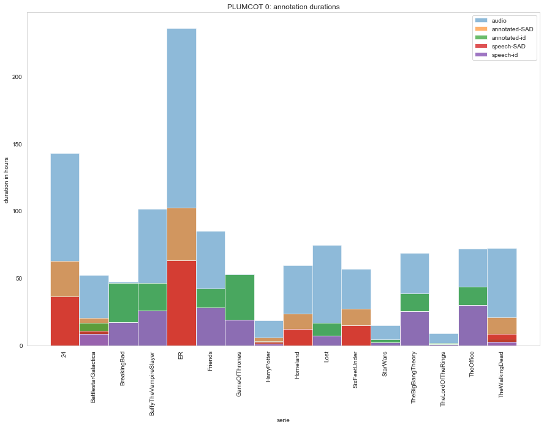

# PLUMCOT 0

> TODO update with entity linking stuff



The PLUMCOT corpus provides annotation for face recognition, speech activity detection, speaker diarization and speaker identification of 16 TV (or movie) series :
- [24](https://www.imdb.com/title/tt0285331/)*
- [BattlestarGalactica](https://www.imdb.com/title/tt0407362/)
- [BreakingBad](https://www.imdb.com/title/tt0903747/)
- [BuffyTheVampireSlayer](https://www.imdb.com/title/tt0118276/)
- [ER](https://www.imdb.com/title/tt0108757/)*
- [Friends](https://www.imdb.com/title/tt0108778/)
- [GameOfThrones](https://www.imdb.com/title/tt0944947/)
- [HarryPotter](https://www.imdb.com/title/tt0241527/)**
- [Homeland](https://www.imdb.com/title/tt1796960/)*
- [Lost](https://www.imdb.com/title/tt0411008/)
- [SixFeetUnder](https://www.imdb.com/title/tt0248654/)*
- [StarWars](https://www.imdb.com/title/tt0076759/)
- [TheBigBangTheory](https://www.imdb.com/title/tt0898266/)
- [TheLordOfTheRings](https://www.imdb.com/title/tt0120737/)
- [TheOffice](https://www.imdb.com/title/tt0386676/)
- [TheWalkingDead](https://www.imdb.com/title/tt1520211/)**


>\*doesn't provide speaker diarization and speaker identification annotations  
\*\*partially provides speaker diarization and speaker identification annotations


Speaker annotations come from forced-alignment on series transcripts except for Breaking Bad and Game Of Thrones which were manually annotated by Bost et al.

Face recognition annotations consists of a dataset of images labeled with the featured characters, scrapped from [IMDb](https://www.imdb.com/). No bounding box nor video identification annotations are provided (for now).

In addition, this repository provides a Python API to access the corpus programmatically.

## Installation

Until the package has been published on PyPI, one has to run the following commands:

```bash
$ git clone https://github.com/PaulLerner/pyannote-db-plumcot.git
$ pip install pyannote-db-plumcot
```

## Usage

Please refer to [pyannote.database](https://github.com/pyannote/pyannote-database#custom-protocols) for a complete documentation.

```bash
export PYANNOTE_DATABASE_CONFIG=$PWD/pyannote-db-plumcot/Plumcot/data/database.yml
python
```

### Speaker Diarization / Identification

```python
>>> from pyannote.database import get_protocol

# you can access the whole dataset using the meta-protocol 'X'
>>> plumcot = get_protocol('X.SpeakerDiarization.Plumcot')
# Note : this might take a while...
>>> plumcot.stats('train')
{'annotated': 710303.0550000002, 'annotation': 383730.8849999984, 'n_files': 681, 'labels': {...}}

# or access each serie individually, e.g. 'HarryPotter'
>>> from pyannote.database import get_protocol
>>> harry = get_protocol('HarryPotter.SpeakerDiarization.0')
>>> harry.stats('train')
{'annotated': 5281.429999999969, 'annotation': 2836.8099999998867, 'n_files': 2, 'labels': {...}}

```

### Speech Activity Detection

Note that the previous dataset is also suitable for Speech Activity Detection but is smaller.

```python
>>> from pyannote.database import get_protocol

# you can access the whole dataset using the meta-protocol 'X'
>>> plumcot = get_protocol('X.SpeakerDiarization.SAD')
# Note : this might take a while...
>>> plumcot.stats('train')
{'annotated': 1286065.3450000014, 'annotation': 716507.5149999945, 'n_files': 1144, 'labels': {...}}

# or access each serie individually, e.g. 'HarryPotter'
>>> harry = get_protocol('HarryPotter.SpeakerDiarization.SAD')
>>> harry.stats('train')
{'annotated': 12864.489999999932, 'annotation': 5853.799999999804, 'n_files': 5, 'labels': {...}}
```
> Note: we don't provide for the series audio or video files! You'll need to acquire them yourself then place them in the relevant serie directory (e.g. `HarryPotter/wavs`) with file name formatted as `<file_uri>.en16kHz.wav`. See also [DVD section](#DVDs).


## Raw data

Transcripts, diarization and entities annotation can be found as text file in `Plumcot/data` sub-directory. Formats etc. are described in `CONTRIBUTING.md`.

The face recognition dataset is provided from an external link : **[TODO](TODO)**. Alternatively, you can scrap the images yourself using `scripts/images_scraping.py` (see `CONTRIBUTING.md`).

### DVDs

Episode numbering relies on [IMDb](https://www.imdb.com/).

We acquired zone 2 (i.e. Europe) DVDs. DVDs were converted to mkv and wav using [dvd_extraction](https://github.com/PaulLerner/dvd_extraction).

`durations.csv` provides the audio duration of the resulting wav files.

Some (double) episodes are numbered as two different episodes in the DVDs although they're numbered as one in IMDb. These are listed in the `double_episodes/` folder of the relevant serie, if needed.

> TODO: automate the creation of `double_episodes/` files so that the user doesn't have to replace `/vol/work3/lefevre/dvd_extracted/` manually.

The episodes are then concatenated using ffmpeg:
```bash
cd pyannote-db-plumcot/
bash scripts/concat_double_episodes.sh <serie_uri> </path/to/wavs>
```

Note that this will only create a new wav file resulting of the concatenation of `<episode.i>` and `<episode.j>` named like `<episode.i.j>` but it will not fix the numbering of the others episodes (TODO: add code to do it ?)

## Ambiguous labels

Some labels are ambiguous depending on whether we focus on the speaker or on the entity.

We decided to focus on the entity as much as possible, e.g. 'Obiwan Kenobi' has the same label in the old and the new Star Wars movies, although it is not the same actor (i.e. speaker).

However, we annotated following the IMDb credits which are not always consistent, e.g. the emperor in Star Wars doesn't have the same label in the old and the new episodes.

> Disclaimer : we do not intend to use the whole `X.SpeakerDiarization.Plumcot` corpus
> to train or evaluate speaker diarization systems! Indeed, the classes are largely
> imbalanced, a lot of actors (i.e. speakers) play in multiple series and a lot of
> characters share labels across series (see `actor_counter` and `counter
>`, respectively).

Moreover, some secondary characters (most don't have proper names) are played by several different actors through the same serie. These are listed in `not_unique.json` and should be removed from the evaluation (TODO).

## LICENSE

### Source code

The source code (or "Software") if freely available under the [MIT License](./LICENSE)

### Speech annotations

All speech annotations, regarding speaker identity or speech regions are licensed under [CC BY 4.0](https://creativecommons.org/licenses/by/4.0/).

### Textual content

All textual content, dialogues and derived annotations are held by their respective owners and their use is allowed under the Fair Use Clause of the Copyright Law.
We only share them for research purposes.

They were scraped from various fan websites:
- https://www.fandom.com/
- http://transcripts.foreverdreaming.org/
- https://www.springfieldspringfield.co.uk/
- http://www.ageofthering.com/
- https://bsg.hypnoweb.net/

## References

Bost, X., Labatut, V., Linares, G., 2020. Serial speakers: a dataset of tv series. arXiv preprint arXiv:2002.06923.
